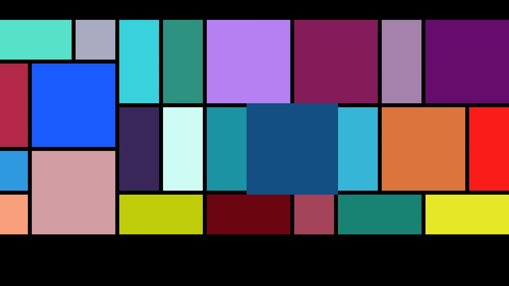

# GridBuilder
A Builder of Android GridLayout

本方案将Android原生容器GridLayout进行封装，只需在指定GridLayout在其父布局中固定容器位置，并通过添加具有行列跨度的item即可动态生成布局。

1.全面支持Android非触屏端(盒子、TV)，支持焦点放大动效

2.支持自定义布局算法(默认自带横向布局Calculator)

3.支持横纵向延伸(需在GridLayout外套ScrollView/HorizontalScrollView)

