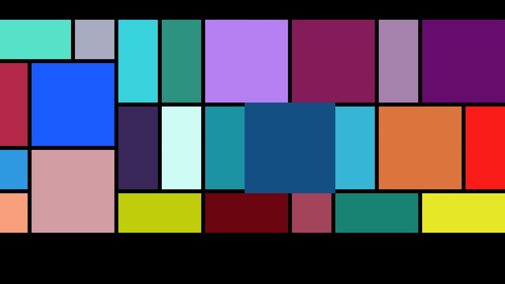

# GridBuilder

GridBuilder是將Android原生容器GridLayout進行封裝，只需在指定GridLayout在布局中的位置，即可通過GridBuilder生成動態柵格布局。

無數據DEMO截圖

商用截圖

## Module：

 **GridBuilderLib**：GridBuilder Library

 **GridBuilderDemo**：應用Demo

## Lib結構：

  **/calculator**：動態布局計算器

  **/listener** ：監聽器

  **/utils**：工具類(目前只有倒影生成工具)

  **GridBuilder**：Lib統壹入口,核心類

  **GridItem**：數據對象必須繼承該抽象類,以規定行列信息

  **IGridItemView**：GridLayout中的Child View必須實現其接口

## 特點：

 1. 全面支持Android非觸屏端(盒子、TV)，支持焦點放大動效
 2. 支持自定義布局算法(默認自帶橫向布局Calculator)
 3. 支持橫縱向延伸(需在GridLayout外套ScrollView/HorizontalScrollView)
 4. 支持動態倒影

## 使用方法：

1.在layout.xml中放置GridLayout

    <RelativeLayout
        android:layout_width="match_parent"
        android:layout_height="match_parent"
        android:orientation="vertical">

            <android.support.v7.widget.GridLayout
                android:layout_width="wrap_content"
                android:layout_height="wrap_content" />
    </RelativeLayout>

2.自定義View實現IGridItemView接口

    public class TestGridItemView extends View implements IGridItemView {

        private GridItem mGridItem;

        public TestGridItemView(Context context) {
            super(context);
        }

        public TestGridItemView(Context context, AttributeSet attrs) {
            super(context, attrs);
        }

        public TestGridItemView(Context context, AttributeSet attrs, int defStyleAttr) {
            super(context, attrs, defStyleAttr);
        }

        @Override
        public GridItem getGridItem() {
            return mGridItem;
        }

        @Override
        public void setGridItem(GridItem gridItem) {
            mGridItem = gridItem;
        }
    }

3.自定義數據對象，繼承GridItem：

    public TestItem extends GridItem {

        // 可添加其他字段以創建自定義View

    }

4.定義或獲取GridItem數據List，GridItem可包含行列跨度信息：

    List<GridItem> gridItemList = new ArrayList<>();
    TestItem item = new TestItem();
    item.setRowSpec(2);
    item.setColumnSpec(3);
    gridItemList.add(item);

5.使用GridBuilder創建動態布局

    GridBuilder.newInstance(this, mGridLayout)
            // 設置item獲取焦點時的放大大小
            .setScaleSize(10, 10)
            // 設置item獲取焦點時放大的動畫delay
            .setScaleAnimationDuration(200)
            // 設置計算器
            .setPositionCalculator(new HorizontalPositionCalculator(5))
            // 設置默認item長寬
            .setBaseSize(100, 100)
            // 設置item之間距離
            .setMargin(10)
            // 設置整個柵格布局外邊距
            .setOutMargin(50, 50, 50, 50)
            // 設置數據
            .setGridItemList(gridItemList)
            // 設置View Holder(用於View被remove後的復用)
            .setViewHolder(holder)
            // 創建Child View
            .setOnCreateViewCallBack(new OnViewCreateCallBack() {
                @Override
                public View onViewCreate(LayoutInflater inflater, View convertView, GridItem gridItem) {
                    TestGridItemView view;
                    if (null == convertView) {
                        view = new TestGridItemView(mContext);
                    } else {
                        view = (TestGridItemView) convertView;
                    }
                    view.setGridItem(gridItem);
                    return view;
                }
            })
            .build();

## 待完善：

1. 動態焦點樣式
2. 資源回收/childView復用
3. 更友好的adapter模式

## 支持：
任何問題可以在項目中[提交bug報告](https://github.com/Eason90/GridBuilder/issues)，也可以發送郵件以尋求幫助。

Email: easonx1990@gmail.com
